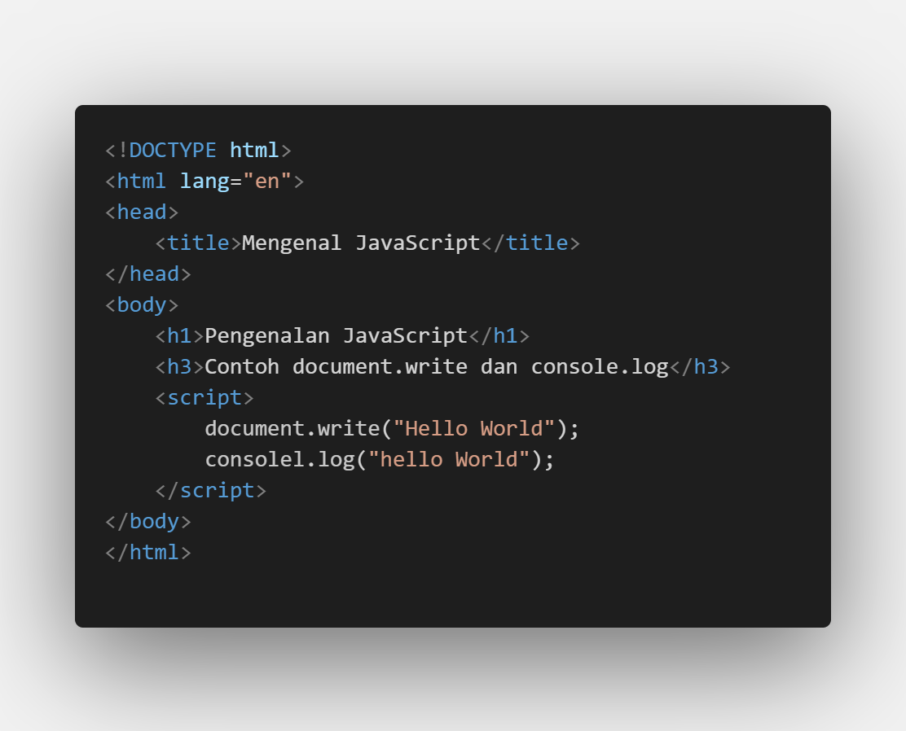
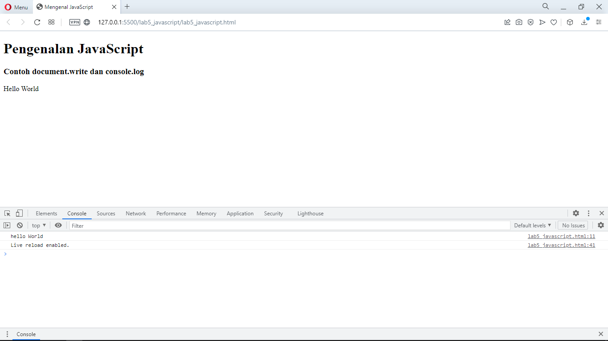
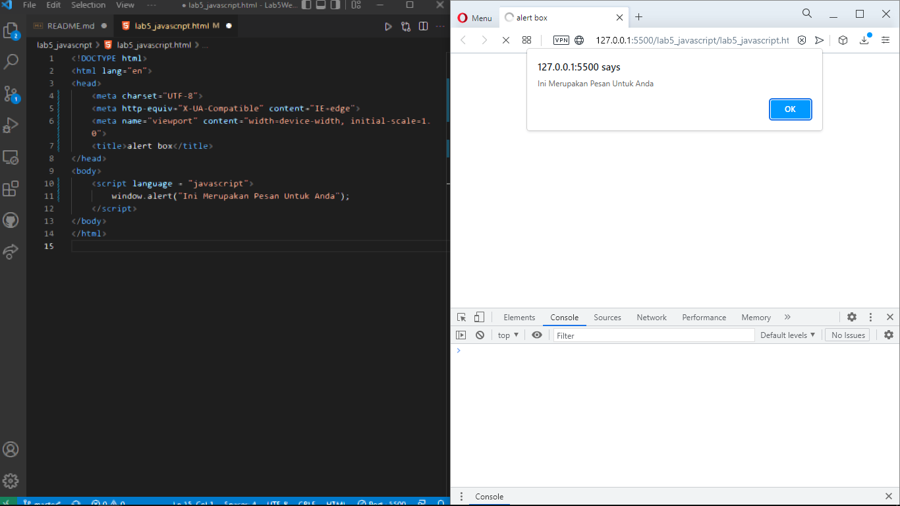
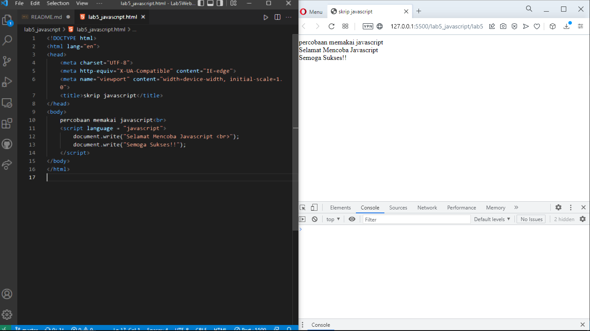
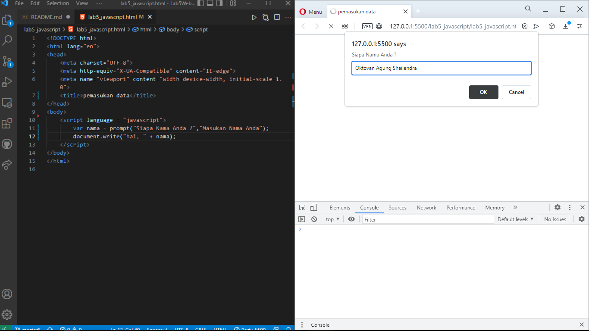
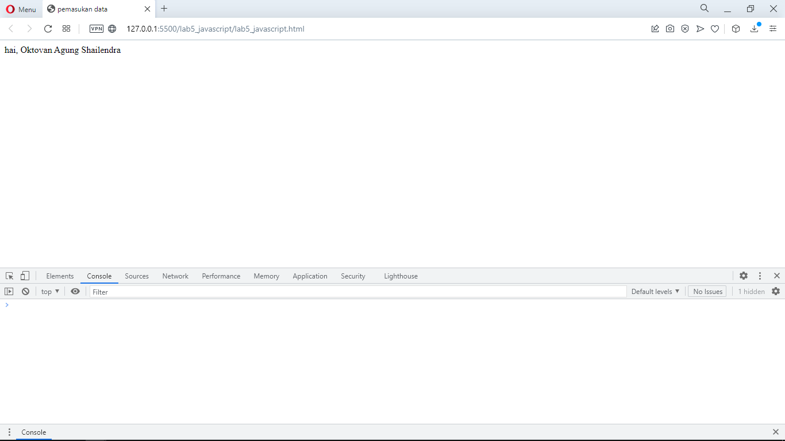
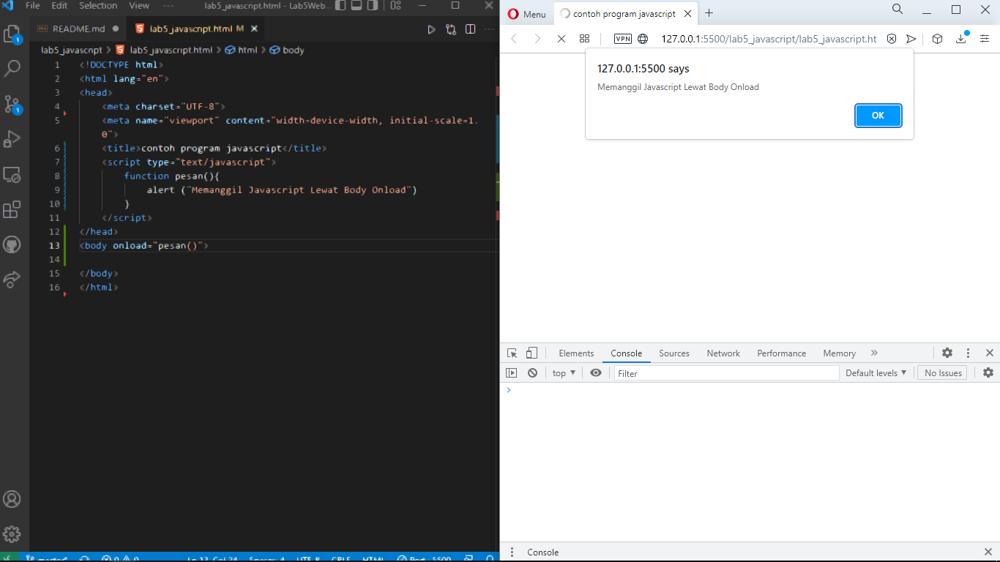
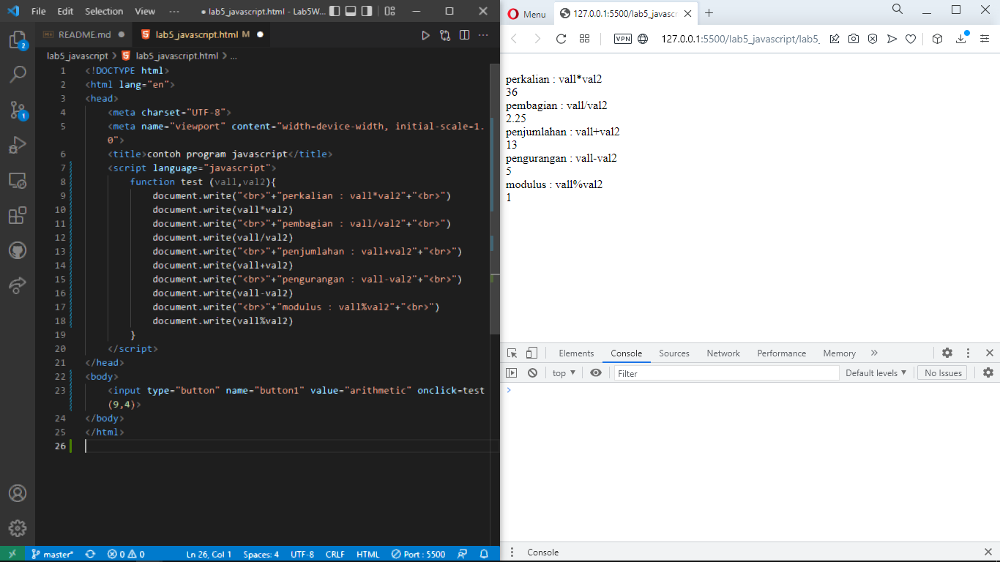
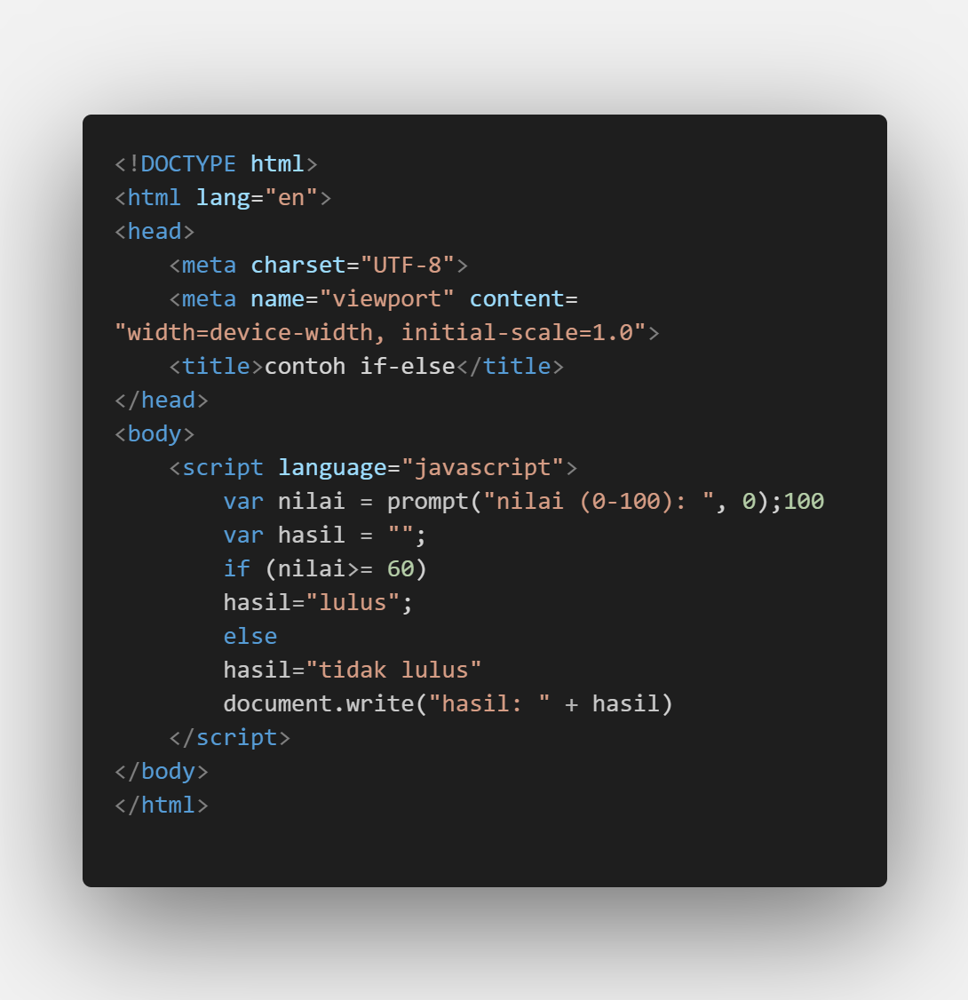

| Nama  | Oktovan Agung Shailendra|
|-------|-------------------------|
|NIM    |312010131                |
| Kelas | TI.20.A.1               |

---

## Langkah-Langkah Praktikum
persiapan memuat dokumen HTML dengan nama file **lab5_javascript.html** seperti berikut.

Dan lihat hasilnya pada web browser

## Javascript Dasar
Pemakaian Alert Sebagai Properti Window.

Pemakaian Metode Dalam Objek

Pemakaian Prompt

Pembuatan Fungsi & Cara Pemanggilannya

## Dasar Pemrograman Di Javascript
Oprasi Dasar Aritmatika

Seleksi Kondisi (if...else)

Jika memasukan nilai kurang dari 60

Jika memasukan nilai lebih dari 60

