| Nama  | Oktovan Agung Shailendra|
|-------|-------------------------|
|NIM    |312010131                |
| Kelas | TI.20.A.1               |

---

## Langkah-Langkah Praktikum
persiapan memuat dokumen HTML dengan nama file **lab5_javascript.html** seperti berikut.

Dan lihat hasilnya pada web browser

## Javascript Dasar
Pemakaian Alert Sebagai Properti Window.

Pemakaian Metode Dalam Objek

Pemakaian Prompt

Pembuatan Fungsi & Cara Pemanggilannya

## Dasar Pemrograman Di Javascript
Oprasi Dasar Aritmatika

Seleksi Kondisi (if...else)

Jika memasukan nilai kurang dari 60

Jika memasukan nilai lebih dari 60

Penggunaan Operator Switch Untuk Seleksi Kondisi
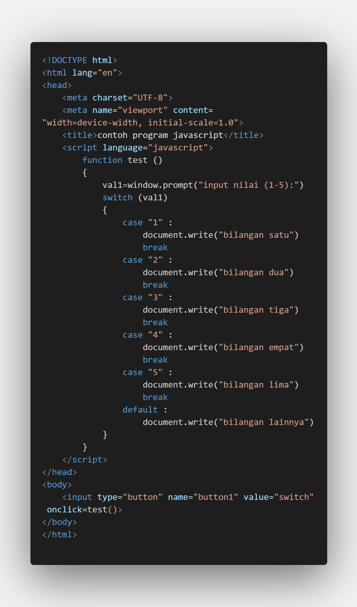

## Pembuatan Form
Form Input
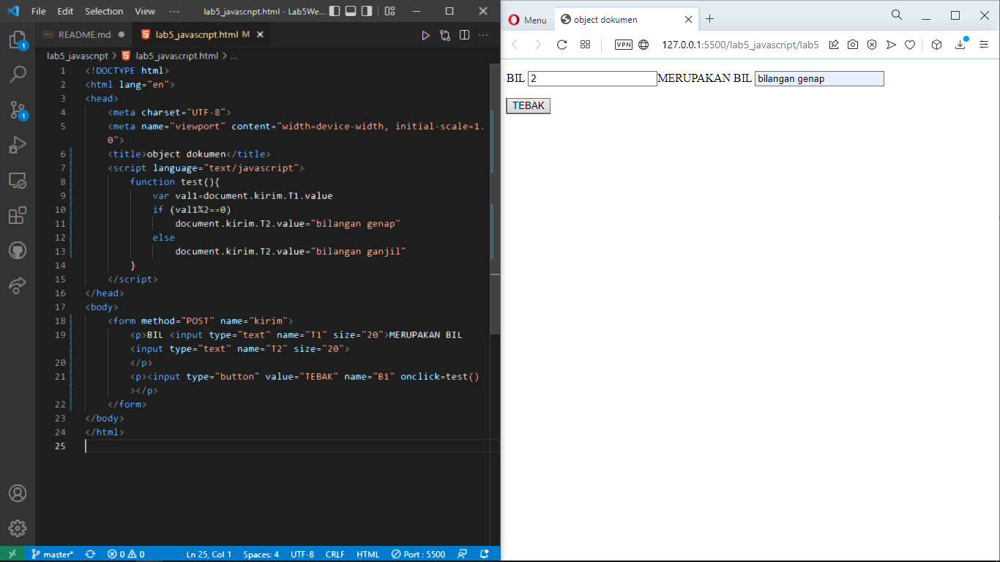

Form Button
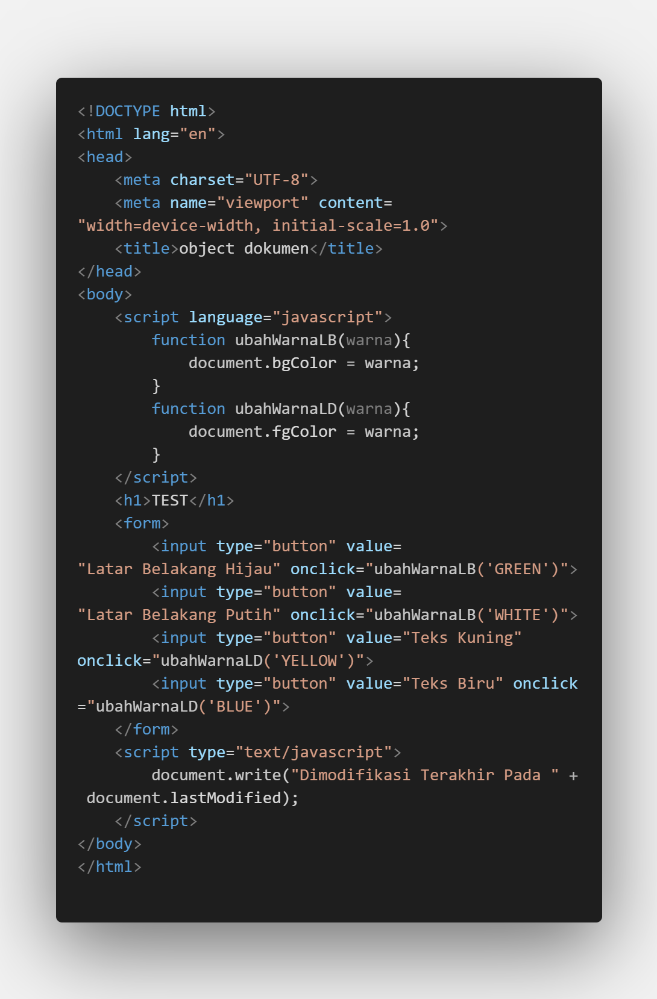
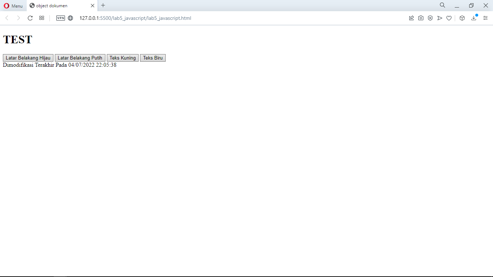
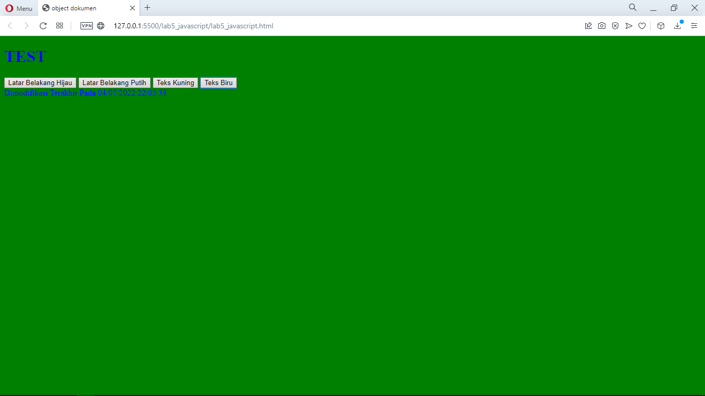
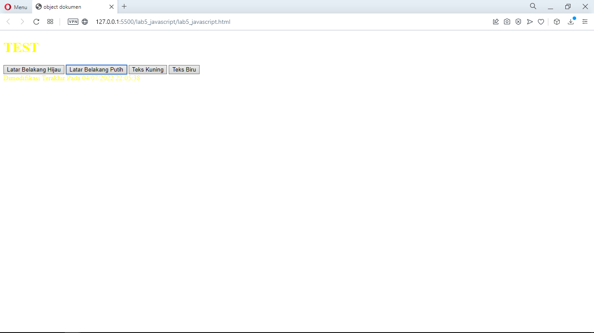

## HTML DOM
Pilihan menggunakan checkBox dengan perhitungan otomatis
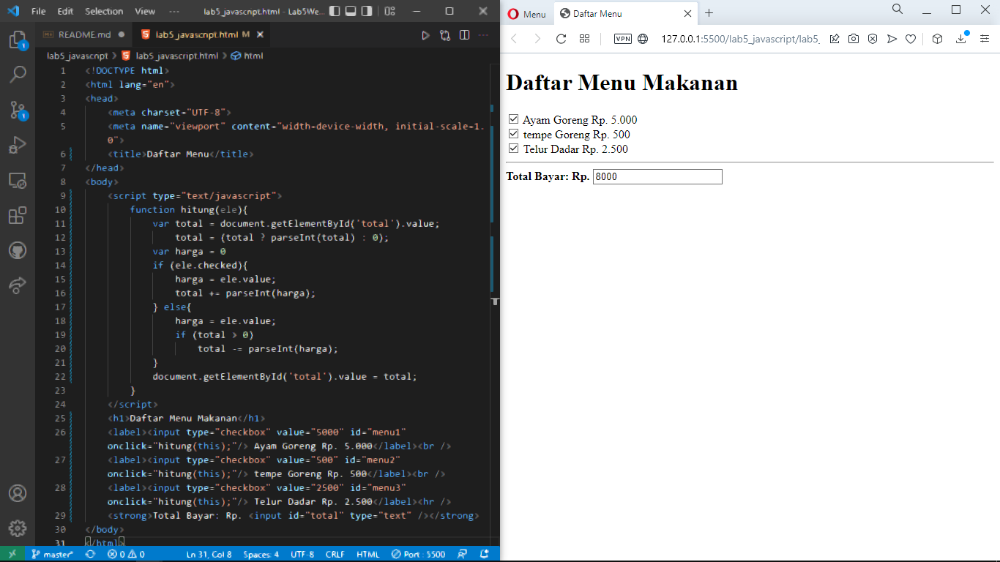

## Pertanyaan & Tugas
1. Buat Script untuk melakukan validasi pada isian form

## JAWABAN

1. Membuat Validasi Nama, NIM, dan E-mail.
### Nama
Validasi nama hanya bisa diisi dengan alfabet (a-z, A-Z) tidak bisa diisi dengan campuran alfabet dengan angka ataupun hanya angka (Abcde123 / 1234)
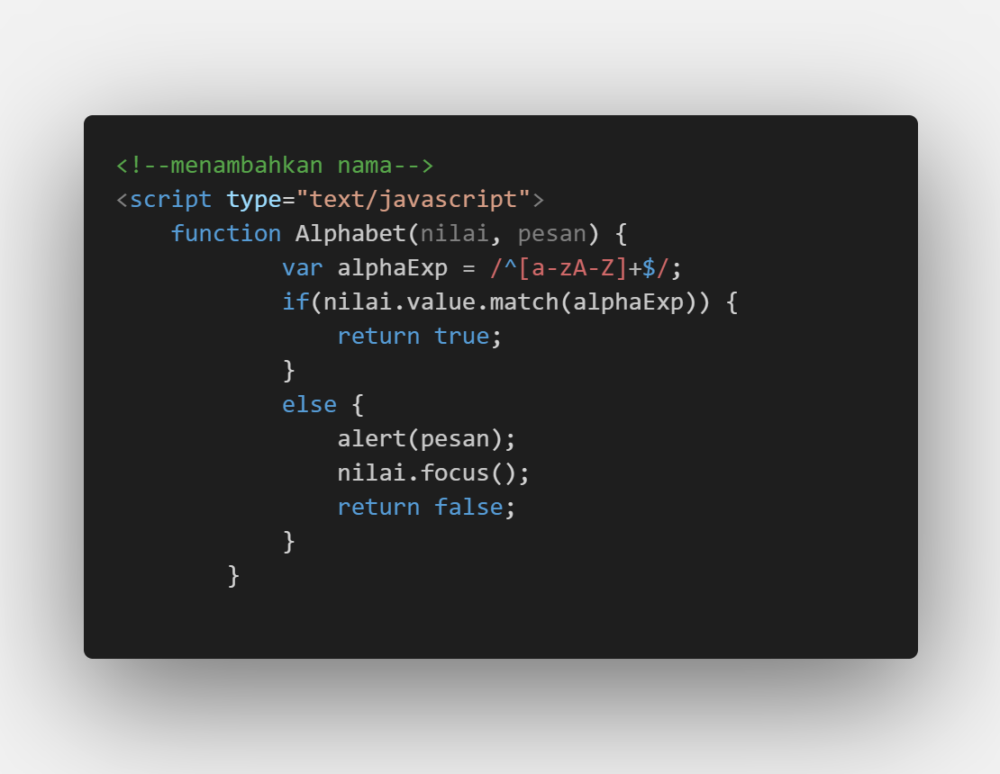
Penjelasan :
- pertama, membuat nama `function Alphabet` dengan parameter dinamis yaitu (nilai,pesan).
- Data yang boleh diinput berupa `a-z, A-Z`.
- Jika selain data `a-z, A-Z` yang diinput maka akan muncul pesan Alert `alert(pesan)`.
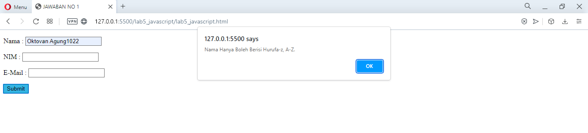

### NIM
Validasi NIM hanya boleh berisi angka (0-9), tidak bisa diisi dengan huruf alfabet.
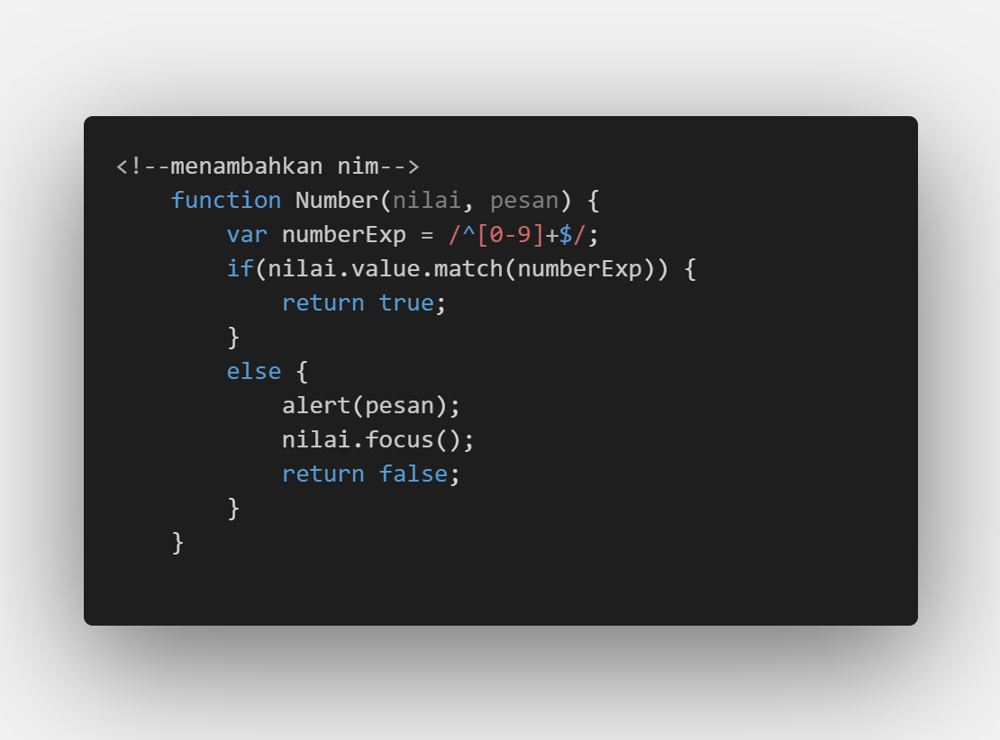
Penjelasan :
- `var numberExp = /^[0-9]+$/;` merupakan variabel numberExp yang diberi batasan validasi angka `(0-9)`.
- Arti Match pada `if(nilai.value.match(numberExp))` adalah string.match(), mencari string menggunakan Regular Expression (Regex)
- Jika inputan tidak benar maka akan ada pesan alert `alert(pesan);`.
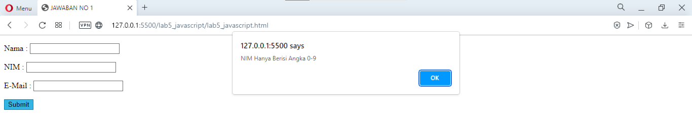

### E-Mail
validasi e-mail masih berupa Regular Expression, contoh : abcd123@gmail.com (benar), abcd123@gmail. (salah).
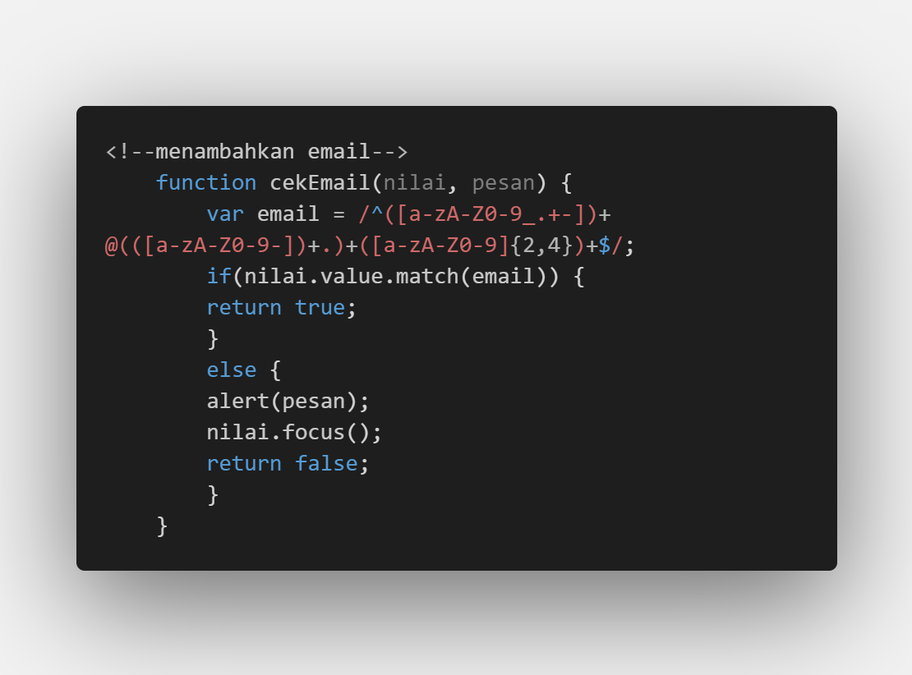
Penjelasan :
- membuat variabel email `var email = /^([a-zA-Z0-9_.+-])+@(([a-zA-Z0-9-])+.)+([a-zA-Z0-9]{2,4})+$/;` berupa huruf, angka dan simbol yang diperbolehkan dalam input sebuah email. Jika email salah maka akan ada pesan alert `alert(pesan);`
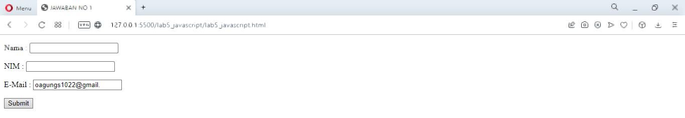

### Menambahkan Alert
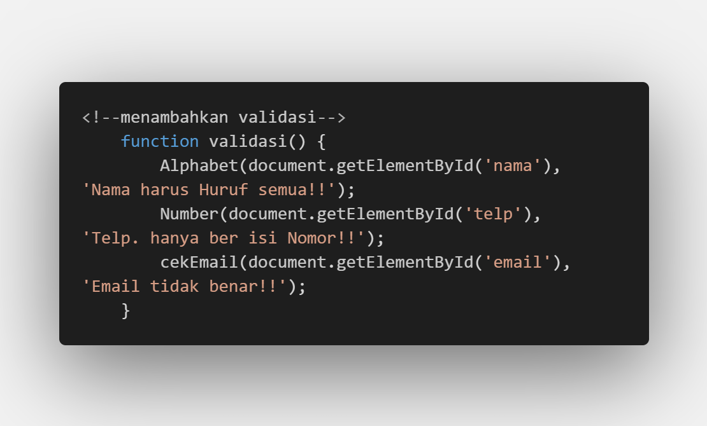

### Menambahkan Form
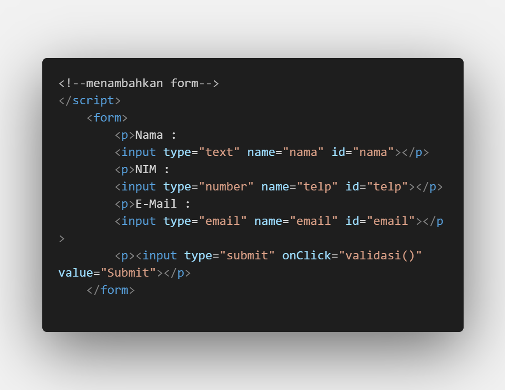

## Kode Secara Keseluruhan
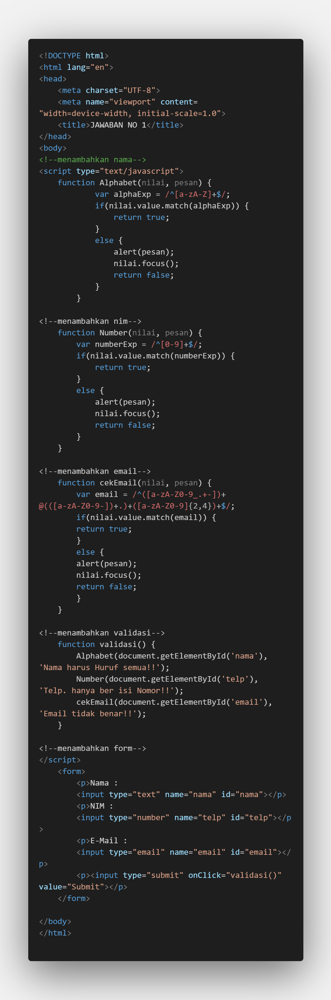

## Pengisian Form Yang Benar
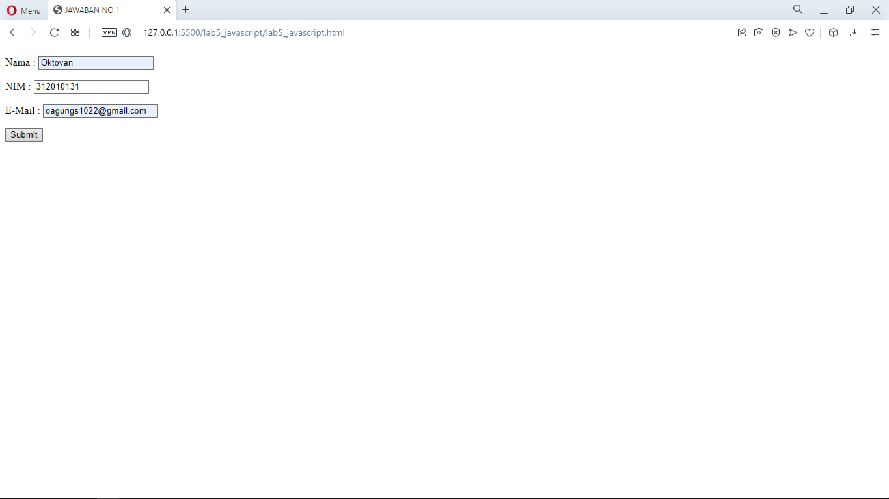